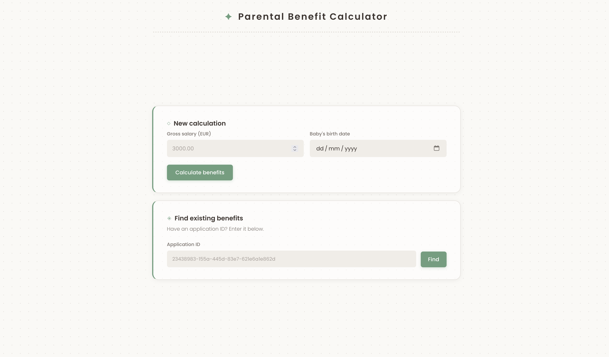
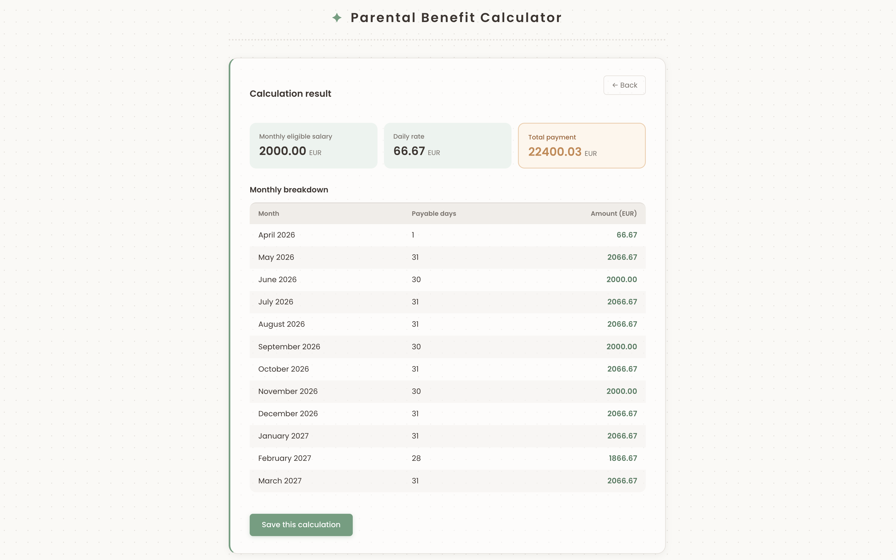

# kood/JobFair 2026 - Helmes Technical Challenge

---

## Overview

A full-stack web application that calculates parental benefits based on user-provided gross salary and child's birth date. Users can view a 12-month payment breakdown and save their application ID to retrieve it later.

--- 

### Features
- Calculate a 12-month parental benefit plan
- View a monthly breakdown of benefit payments
- Save a calculation to receive a unique ID
- Retrieve a saved calculation using its ID

--- 

### Calculation Logic

The monthly benefit equals the parent's gross salary, capped at €4,000/month.
Payments use a daily rate (salary ÷ 30), with the first month calculated from the birth date to end of month.

---

### Built with
- **Backend:** Java, Spring Boot
- **Database:** PostgreSQL
- **Frontend:** Vue, TypeScript, Vite
- **Infrastructure:** Docker

--- 

**Live Demo:** You can check it out at **[here](https://jobfair-helmes.teymm.site/)**!

---

### Main view
</img>
### Result view
</img>

--- 

## Setup & Usage

### Prerequisites

- Java 25
- Node 25
- Docker 29

---

### Setup

1. Clone the repository:

```bash
git clone https://github.com/Gross-Johannes/jobfair-helmes.git
```

2. Navigate to the project directory:

```bash
cd jobfair-helmes
```

3. Copy the example environment file:

```bash
cp .env.example .env
```

4. Update the `.env` file with your configuration settings.

---

### Running the Application

#### ~ Development Mode ~

1. Start the PostgreSQL database using Docker:

```bash
make dev-up
```

2. Export required environment variables:

```bash
export DB_URL=jdbc:postgresql://HOST:PORT/DB_NAME
export DB_USERNAME=your_db_username
export DB_PASSWORD=your_db_password
```

3. Navigate to the backend directory:

```bash
cd backend
```

4. Run the Spring Boot application:

```bash
./mvnw spring-boot:run
```

5. Navigate to the frontend directory:

```bash
cd ../frontend
```

6. Install dependencies and start the application:

```bash
npm install
npm run dev
```

**Once everything is running, the application is available at:**

- **Frontend Local URL:** [http://localhost:5173](http://localhost:5173)

---

#### ~ Production Mode ~

1. Start the application using Docker Compose:

```bash
make prod-up
```

**The application will be available at:**

- **Frontend Production URL:** [http://localhost:8080](http://localhost:8080)

--- 

## Backend API docs

The API documentation is generated using SpringDoc and is available at the following endpoint when the application is running:

- **Swagger UI**: [http://localhost:8080/swagger-ui.html](http://localhost:8080/swagger-ui.html)

- **Raw OpenAPI JSON**: [http://localhost:8080/v3/api-docs](http://localhost:8080/v3/api-docs)

--- 

## Testing the Application

### Option 1: Swagger UI 

1. Start the application
2. Open your browser: [http://localhost:8080/swagger-ui/index.html](http://localhost:8080/swagger-ui/index.html)
3. Browse and test endpoints interactively
4. No additional setup required

### Option 2: Postman
A Postman collection is included at [docs/postman/jobfair-helmes.postman_collection.json](docs/postman/jobfair-helmes.postman_collection.json)

1. Start the application
2. Import the provided Postman collection:
   - Open Postman
   - Click **Import** → **File**
   - Select `docs/postman/jobfair-helmes.postman_collection.json`.
3. Click **Send** on any request
4. View the response in the bottom panel

---

## Contributors

This project was developed by batch 7 students:
- **Evert Edesi** ([CyberEvert](https://github.com/CyberEvert))
- **Johannes Gross** ([Gross-Johannes](https://github.com/Gross-Johannes))
- **Mari Armei** ([murilane](https://github.com/murilane))